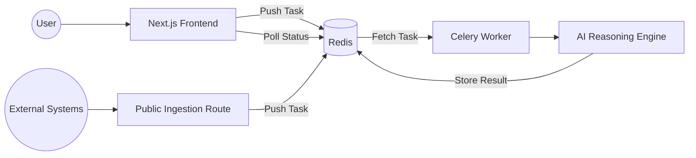

# IncidentFlow: AI-Powered Incident Response Platform

IncidentFlow is a modern SaaS platform designed for high-velocity engineering teams to resolve incidents faster using AI-driven root cause analysis and automated workflows.

## 🚀 Project Overview

The project consists of two main components working in harmony:
1.  **Frontend (Next.js)**: A premium, professional web interface featuring a landing page, an interactive dashboard, and public API ingestion.
2.  **Backend (AI Engine)**: A Python-based reasoning engine that processes incident signals using Large Language Models (LLMs) to generate diagnoses and recommendations.

## 🏗️ Architecture

IncidentFlow is built on a **Decoupled Event-Driven Architecture**. This design allows the Next.js frontend to remain lightning-fast and stateless while offloading intensive AI reasoning to a specialized Python worker.

The integration is achieved by manually implementing the **Celery Wire Protocol** within the Next.js API layer, enabling direct task injection into Redis without requiring a heavy Python bridge.



## 🧠 AI Reasoning Logic

The engine utilizes a **Multi-Step Chain-of-Thought** prompt pattern to transform raw noise into actionable insights:

1.  **Signal Analysis**: Parses raw telemetry (CPU usage, stack traces, latency metrics) to identify anomalies.
2.  **Hypothesis Generation**: Generates 3 distinct potential root causes based on historical patterns and current signals.
3.  **Confidence Scoring**: Assigns a mathematical probability score to each hypothesis using a secondary "critic" pass.
4.  **Pydantic Validation**: Ensures the final output strictly adheres to the SRE schema, preventing model hallucinations and ensuring type safety for the frontend.

## 🛠️ Tech Stack

### Frontend (Next.js)
- **Framework**: Next.js 16 (App Router)
- **Styling**: Tailwind CSS 4
- **Icons**: Lucide React
- **Integration**: ioredis (Redis Client)
- **Interactivity**: Framer Motion (planned) / Custom CSS Transitions

### AI Backend (Python)
- **Framework**: Python 3.12+
- **Task Queue**: Celery
- **Message Broker**: Redis
- **Reasoning**: OpenAI / Custom LLM Prompting
- **Validation**: Pydantic

## 📦 Getting Started

### Prerequisites
- Node.js 18+
- Python 3.12+
- Redis Server (running on localhost:6379)

### 1. Backend Setup (AI)
```bash
cd AI
python -m venv .venv
source .venv/bin/activate  # On Windows: .venv\Scripts\activate
pip install -r requirements.txt
```
**Start the Celery Worker:**
```bash
# From the AI/ directory
celery -A src.celery_app worker --loglevel=info -Q sre_incidents
```

### 2. Frontend Setup (Next.js)
```bash
cd next
npm install
```
**Start the Development Server:**
```bash
npm run dev
```

## 🔌 API Documentation

### Public Ingestion (`POST /api/v1/report`)
Allows external systems (GitHub Actions, CI/CD, local scripts) to report incidents.

**Payload:**
```json
{
  "incident_id": "INC-123",
  "signals": {
    "service": "api-gateway",
    "error_rate": "5%",
    "message": "Spike in 5xx errors detected"
  }
}
```

**Response (202 Accepted):**
```json
{
  "task_id": "uuid-xxxx",
  "results_url": "http://localhost:3000/reports/uuid-xxxx",
  "message": "Incident report accepted for analysis"
}
```

## 🎨 Key Features

- **Split-Screen Hero**: High-conversion landing page design.
- **Interactive Dashboard**: Real-time stats, incident trends (bar charts), and live incident feed.
- **One-Click Diagnosis**: Submit any incident for AI analysis directly from the dashboard.
- **Public Report Pages**: Shareable diagnosis results for external stakeholders.
- **Cellery Integration**: Robust task queuing for asynchronous AI processing.

## 📂 Directory Structure

- `/AI`: Python source code, Celery app, and reasoning engine.
- `/next`: Next.js application, components, and API routes.
- `/.gemini/antigravity/brain`: Project artifacts (Task lists, Implementation plans, Walkthroughs).

---
Developed with ❤️ by the IncidentFlow Team.
